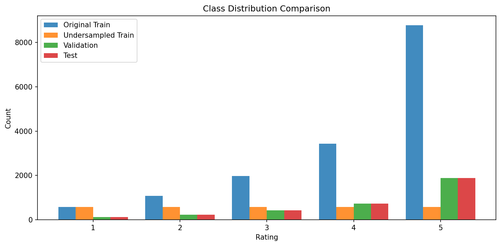
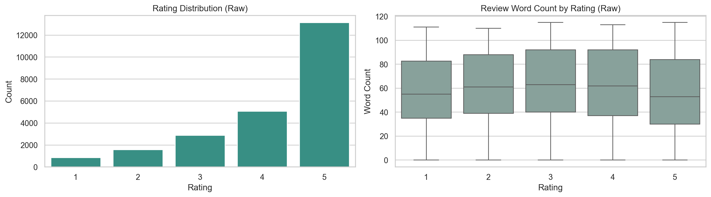
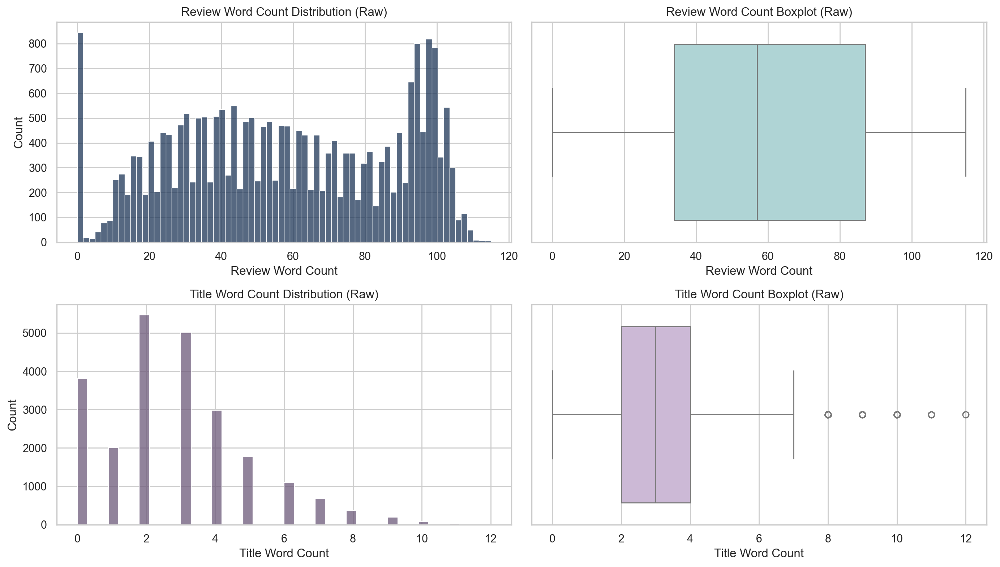
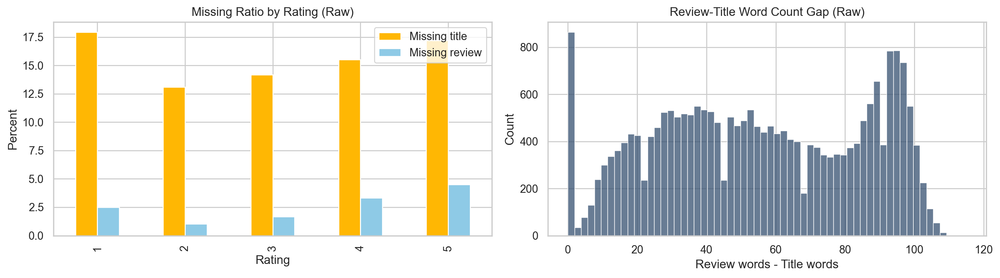
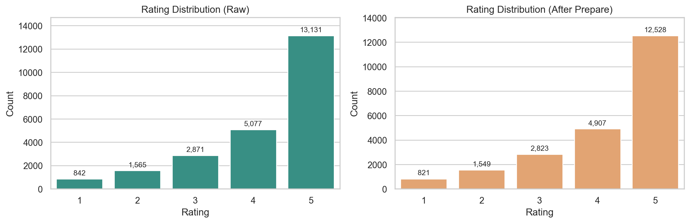
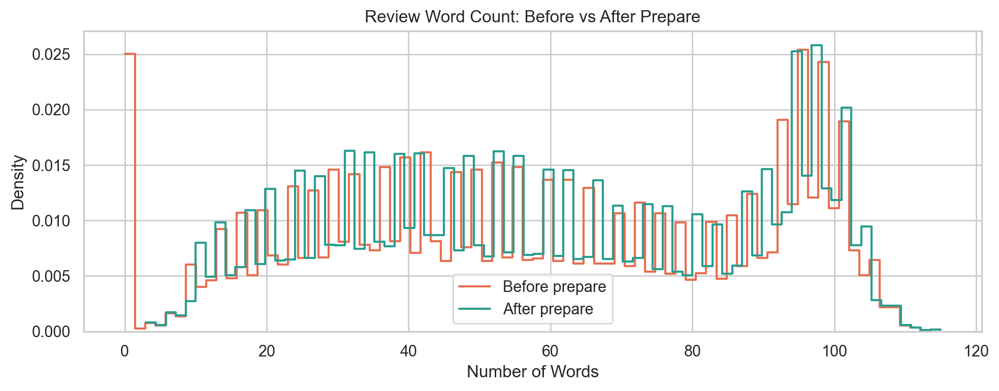
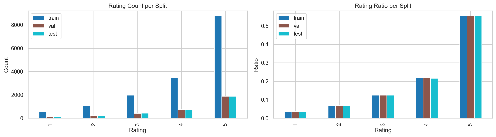
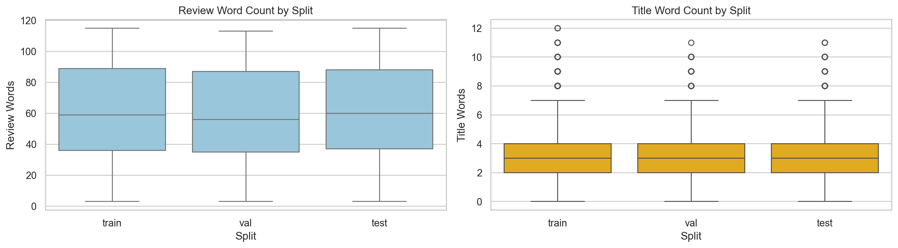
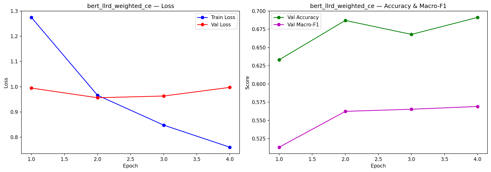
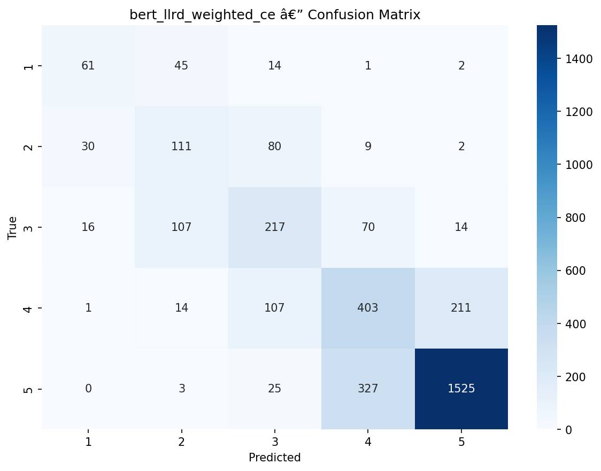

# Model Report

## Weights & Biases

Dashboard: https://api.wandb.ai/links/huy-nguyentuank22-ho-chi-minh-city-university-of-technology/igh06zwd

## Data Split Overview

### Class Distribution Comparison

## EDA (Title + Review Text -> Rating)

Phần EDA bên dưới chỉ tập trung vào 3 cột phục vụ mô hình: `title`, `review_text`, `rating`.
Các hình được xuất từ notebook `notebooks/eda.ipynb` vào thư mục `outputs/figures/eda`.

### Raw Data Overview

### After Prepare Data Overview

### Train Val Test Split Checks

## Full Model Comparison (All Runs)

| model_name | accuracy | macro_f1 | weighted_f1 | precision | recall | mae | model_size_mb | inference_time_per_sample_ms |
|---|---:|---:|---:|---:|---:|---:|---:|---:|
| **bert_llrd_weighted_ce** | **0.6825** | **0.5646** | **0.6891** | **0.5636** | 0.5690 | **0.3505** | 417.66 | 6.7528 |
| bert_full_undersample_ce | 0.6563 | 0.5490 | 0.6671 | 0.5296 | **0.5790** | 0.3932 | 417.66 | 6.7489 |
| bert_full_weighted_ce | 0.6772 | 0.5471 | 0.6851 | 0.5632 | 0.5449 | 0.3508 | 417.66 | 6.7471 |
| distilbert_full_weighted_ce | 0.6707 | 0.5421 | 0.6772 | 0.5352 | 0.5507 | 0.3688 | 253.17 | 3.3772 |
| distilbert_llrd_weighted_ce | 0.6630 | 0.5409 | 0.6733 | 0.5453 | 0.5470 | 0.3773 | 253.17 | 3.3862 |
| bert_llrd_undersample_ce | 0.6580 | 0.5247 | 0.6615 | 0.5190 | 0.5424 | 0.3882 | 417.66 | 6.7524 |
| distilbert_llrd_undersample_ce | 0.6345 | 0.5205 | 0.6472 | 0.4996 | 0.5565 | 0.4315 | 253.17 | 3.3857 |
| distilbert_full_undersample_ce | 0.6306 | 0.5181 | 0.6432 | 0.4971 | 0.5537 | 0.4348 | 253.17 | 3.3821 |
| bilstm_attention_weighted_ce | 0.6356 | 0.4921 | 0.6421 | 0.5085 | 0.4860 | 0.4150 | 15.25 | 0.5938 |
| bilstm_weighted_ce | 0.6524 | 0.4854 | 0.6511 | 0.4948 | 0.4783 | 0.4118 | 15.25 | **0.5860** |
| bilstm_attention_undersample_ce | 0.5470 | 0.4354 | 0.5692 | 0.4351 | 0.4515 | 0.5523 | 12.08 | 0.5934 |
| bilstm_undersample_ce | 0.5432 | 0.3825 | 0.5544 | 0.3779 | 0.4253 | 0.6789 | 12.08 | 0.5879 |
| distilbert_freeze_weighted_ce | 0.5490 | 0.2826 | 0.5302 | 0.2901 | 0.2961 | 0.6071 | 253.17 | 3.3827 |
| bert_freeze_weighted_ce | 0.4901 | 0.2525 | 0.4682 | 0.2601 | 0.2607 | 0.7735 | 417.66 | 6.7354 |
| bert_freeze_undersample_ce | 0.3711 | 0.2267 | 0.4032 | 0.2363 | 0.2363 | 1.2006 | 417.66 | 6.7392 |
| distilbert_freeze_undersample_ce | 0.4309 | 0.1944 | 0.4033 | 0.2634 | 0.2353 | 0.9458 | 253.17 | 3.3818 |

## Best Model by Family (Macro-F1)

| Family | Best Checkpoint | Macro-F1 | Accuracy | MAE |
|---|---|---:|---:|---:|
| BiLSTM | bilstm_weighted_ce | 0.4854 | 0.6524 | 0.4118 |
| BiLSTM+Attention | bilstm_attention_weighted_ce | 0.4921 | 0.6356 | 0.4150 |
| DistilBERT | distilbert_full_weighted_ce | 0.5421 | 0.6707 | 0.3688 |
| BERT-base | bert_llrd_weighted_ce | **0.5646** | **0.6825** | **0.3505** |

Overall best model: **bert_llrd_weighted_ce**.

## Best Model Visualizations

### Training Curves (Best Model)

### Confusion Matrix (Best Model)

## Ensemble Results

### Alpha Search (BERT-full-undersample + BERT-full-weighted)

| alpha | accuracy | macro_f1 | weighted_f1 | precision | recall | mae |
|---:|---:|---:|---:|---:|---:|---:|
| 0.3 | 0.6851 | 0.5589 | 0.6929 | **0.5717** | 0.5582 | 0.3440 |
| 0.4 | **0.6863** | 0.5599 | **0.6943** | 0.5681 | 0.5612 | **0.3434** |
| 0.5 | 0.6834 | **0.5647** | 0.6917 | 0.5660 | 0.5688 | 0.3487 |
| 0.6 | 0.6722 | 0.5579 | 0.6817 | 0.5492 | **0.5700** | 0.3641 |
| 0.7 | 0.6645 | 0.5498 | 0.6747 | 0.5355 | 0.5694 | 0.3785 |

### Single vs Ensemble

| model | accuracy | macro_f1 | weighted_f1 | precision | recall | mae | alpha |
|---|---:|---:|---:|---:|---:|---:|---:|
| BERT-full-undersample | 0.6563 | 0.5490 | 0.6671 | 0.5296 | **0.5790** | 0.3932 | - |
| BERT-full-weighted | 0.6772 | 0.5471 | 0.6851 | 0.5632 | 0.5449 | 0.3508 | - |
| Ensemble (BERT-full-undersample + BERT-full-weighted, alpha=0.5) | **0.6834** | **0.5647** | **0.6917** | **0.5660** | 0.5688 | **0.3487** | 0.5 |

## Robustness (Clean vs Noisy)

| model_name | clean_accuracy | noisy_accuracy | drop_accuracy | clean_macro_f1 | noisy_macro_f1 | drop_macro_f1 | clean_mae | noisy_mae | drop_mae |
|---|---:|---:|---:|---:|---:|---:|---:|---:|---:|
| BiLSTM | 0.6524 | 0.6194 | 0.0330 | 0.4854 | 0.4280 | 0.0574 | 0.4118 | 0.4636 | 0.0518 |
| BiLSTM+Attention | 0.6356 | 0.6024 | 0.0333 | 0.4921 | 0.4395 | 0.0525 | 0.4150 | 0.4574 | 0.0424 |
| DistilBERT | 0.6707 | 0.6663 | **0.0044** | 0.5421 | 0.5228 | **0.0193** | 0.3688 | 0.3944 | 0.0256 |
| BERT-base | **0.6825** | **0.6736** | 0.0088 | **0.5646** | **0.5322** | 0.0324 | **0.3505** | **0.3723** | **0.0218** |

## Error Analysis (Best per Family)

| model_family | checkpoint | accuracy | mae | error_rate |
|---|---|---:|---:|---:|
| bilstm | bilstm_weighted_ce | 0.6524 | 0.4118 | 0.3476 |
| bilstm_attn | bilstm_attention_weighted_ce | 0.6356 | 0.4150 | 0.3644 |
| distilbert | distilbert_full_weighted_ce | 0.6707 | 0.3688 | 0.3293 |
| bert | bert_llrd_weighted_ce | **0.6825** | **0.3505** | **0.3175** |

Top confusion pairs của model tốt nhất (bert_llrd_weighted_ce):

| True | Pred | Count |
|---:|---:|---:|
| 5 | 4 | 327 |
| 4 | 5 | 211 |
| 3 | 2 | 107 |
| 4 | 3 | 107 |
| 2 | 3 | 80 |

Error category chính (bert_llrd_weighted_ce):

| Category | Count |
|---|---:|
| subtle_rating_difference | 45 |
| mixed_sentiment | 4 |
| ambiguous_review | 1 |

## Insights & Nhận Xét

1. Mô hình tốt nhất toàn cục hiện tại là bert_llrd_weighted_ce (accuracy 0.6825, macro-F1 0.5646, MAE 0.3505), đứng đầu cả accuracy lẫn macro-F1, đồng thời cho MAE thấp nhất trong nhóm best-per-family.
2. Chênh lệch weighted-F1 (0.6891) và macro-F1 (0.5646) khá lớn (~0.1245), cho thấy bài toán còn ảnh hưởng mạnh bởi mất cân bằng lớp; mô hình làm tốt hơn ở lớp chiếm đa số.
3. Từ confusion matrix của model tốt nhất, lỗi chủ yếu tập trung ở các cặp nhãn liền kề (5↔4, 4↔3, 3↔2), phù hợp bản chất rating ordinal (đánh giá gần nhau khó tách).
4. Class 5 là lớp dễ nhận diện nhất (recall xấp xỉ 81%), trong khi các lớp thấp hơn (1-3) kém ổn định hơn; đây là dấu hiệu dữ liệu nghiêng mạnh về review tích cực.
5. Training curve của bert_llrd_weighted_ce cho thấy train loss giảm đều nhưng val loss tăng nhẹ ở cuối; dù vậy val macro-F1 vẫn cải thiện, nên cần ưu tiên checkpoint theo macro-F1 thay vì chỉ dựa vào loss.
6. Ensemble giữa BERT-full-undersample và BERT-full-weighted cho macro-F1 tốt nhất tại alpha=0.5 (0.5647); tuy nhiên alpha=0.4 lại tốt hơn về accuracy (0.6863) và MAE (0.3434), cho thấy trade-off metric khá rõ.
7. Về robustness với nhiễu, DistilBERT ổn định nhất theo score metrics (drop accuracy 0.0044, drop macro-F1 0.0193), trong khi BERT-base có độ tăng lỗi ordinal nhỏ nhất theo MAE (drop_mae 0.0218).
8. Về triển khai thực tế: BiLSTM có tốc độ suy luận nhanh nhất (0.5860 ms/sample), nhanh hơn BERT-base khoảng 11.5x; DistilBERT là điểm cân bằng tốt giữa hiệu năng và chi phí (nhanh gần 2x, nhẹ hơn khoảng 39% so với BERT-base).

### Kết luận ngắn

- Nếu ưu tiên chất lượng tổng thể: chọn bert_llrd_weighted_ce.
- Nếu ưu tiên độ bền khi gặp nhiễu: cân nhắc distilbert_full_weighted_ce.
- Nếu ưu tiên latency/chi phí: cân nhắc bilstm_weighted_ce hoặc DistilBERT tùy ngưỡng chất lượng yêu cầu.

## XAI Artifacts

Các file giải thích mô hình đã sinh:

- outputs/reports/xai_results/bert_xai.html
- outputs/reports/xai_results/distilbert_xai.html
- outputs/reports/xai_results/bilstm_xai.html
- outputs/reports/xai_results/bilstm_attention_xai.html
- outputs/reports/xai_results/bilstm_attention_lime.html